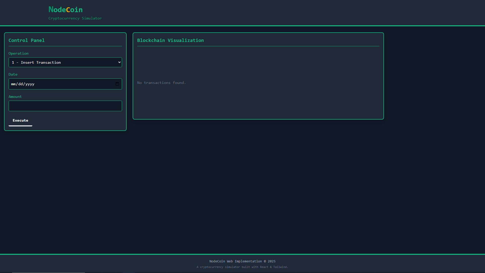

# NodeCoin Web Implementation

A modern web-based cryptocurrency simulator based on custom data structures. This project is the web implementation of the NodeCoin-Python project, demonstrating how doubly linked lists, heaps, and nodes can be used to create a simplified cryptocurrency system for learning purposes.



## 🚀 Features

- **Efficient Data Structure**: Combines linked lists and max heaps to handle cryptocurrency transactions
- **Modern UI/UX**: Built with React and Tailwind CSS for a responsive interface
- **Interactive Operations**:
    - 💰 Insert Transaction: Add new transactions to specific dates
    - 📊 Get Maximum Transaction: Quickly fetch the highest value transaction for any date
    - 🗑️ Remove Maximum Transaction: Remove the highest value transaction from a date
    - 📋 Get All Transactions: Retrieve and clear all transactions for a specific date
- **Real-time Visualization**: See the blockchain structure update as you perform operations
- **Animation Effects**: Visual feedback when interacting with nodes and transactions

## 🛠️ Technologies Used

- **React**: Front-end library for building the user interface
- **Tailwind CSS**: Utility-first CSS framework for styling
- **JavaScript**: Implementation of complex data structures (MaxHeap, Linked List, etc.)
- **Modern ES6+**: Leveraging current JavaScript features for clean code

## 🧩 Core Data Structures

- **MaxHeap**: Manages transactions using a max heap for efficient retrieval of highest values
- **Node**: Represents each unique date with its transactions
- **NodeCoin**: Manages all nodes using a doubly linked list structure
- **Transaction**: Represents individual cryptocurrency transfers

## 📋 Getting Started

### Prerequisites

- Node.js (v14 or higher)
- npm or yarn

### Installation

1. Clone the repository:
   ```bash
   git clone https://github.com/yourusername/NodeCoin-WebBased.git
   cd NodeCoin-WebBased/nodecoin-web
   ```

2. Install dependencies:
   ```bash
   npm install
   # or
   yarn install
   ```

3. Start the development server:
   ```bash
   npm start
   # or
   yarn start
   ```

4. Open [http://localhost:3000](http://localhost:3000) in your browser

## 💻 Usage

1. **Insert Transaction**:
    - Select "1 - Insert Transaction" from the operation dropdown
    - Choose a date from the date picker
    - Enter a transaction amount
    - Click "Execute"

2. **Get Maximum Transaction**:
    - Select "2 - Get Maximum Transaction" from the dropdown
    - Choose a date
    - Click "Execute" to see the highest value transaction for that date

3. **Remove Maximum Transaction**:
    - Select "3 - Remove Maximum Transaction" from the dropdown
    - Choose a date
    - Click "Execute" to remove the highest value transaction

4. **Get All Transactions**:
    - Select "4 - Get All Transactions" from the dropdown
    - Choose a date
    - Click "Execute" to remove and display all transactions for that date

## ⚙️ Available Scripts

- **`npm start`**: Runs the app in development mode at [http://localhost:3000](http://localhost:3000)
- **`npm test`**: Launches the test runner in interactive watch mode
- **`npm run build`**: Builds the app for production to the `build` folder
- **`npm run deploy`**: Deploys the app to GitHub Pages (after configuration)


## 📂 Project Structure

```
nodecoin-web/
├── public/              # Static files
├── src/
│   ├── components/      # React components
│   ├── lib/             # Core implementation
│   │   ├── models/      # Data structure classes
│   │   └── utils/       # Utility functions
│   ├── App.jsx          # Main application component
│   └── index.js         # Application entry point
├── package.json         # Dependencies and scripts
└── tailwind.config.js   # Tailwind CSS configuration
```

## 🙏 Acknowledgments

- **Dr. Basit Qureshi**: For guiding and teaching data structures in the CS210 course
- The original NodeCoin-Python project which served as the foundation for this implementation
- React and Tailwind CSS communities for their excellent documentation and tools

## 📄 License

This project is licensed under the MIT License - see the LICENSE file for details.